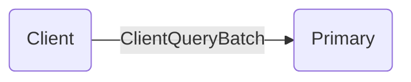
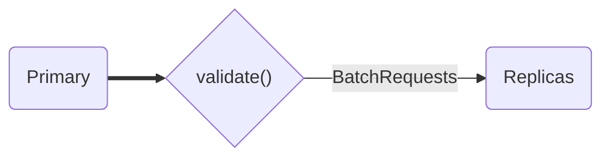
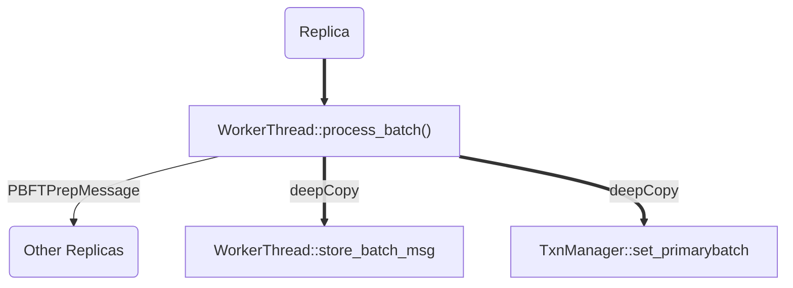
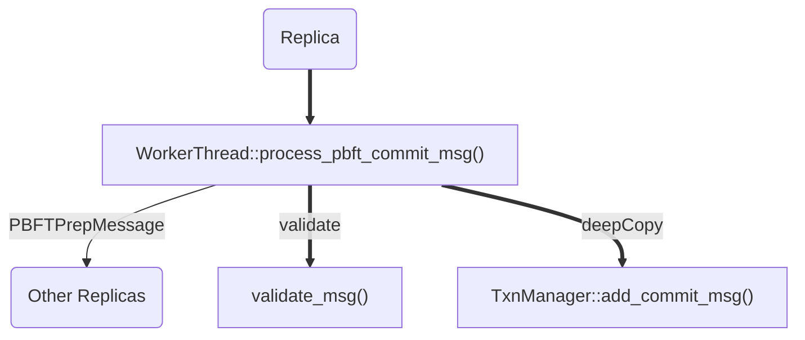

Allow this article to be a comprehensive introduction into the **Practical Byzantine Fault Tolerance Consensus Protocol (PBFT)** through the lens of the ResilientDB codebase. We will detail the sequences and algorithms which encompass the protocol and encourage the readers to explore the rigorous math proofs afterwards.

The true power of this protocol becomes evident quite quick; it enables a democratic (i.e. through consensus) and decentralized (i.e. through replication) computational model! 

### Blockchain Consensus 

The aim of a BFT consensus protocol for the application of blockchain is to ensure that all *non-faulty* replicas, that is replicas acting in bad faith, have the **same lineariazability guarantee**; where they assign the **same** order for a given client transaction[^1]. This is a tolerance more resilient than achieving consensus in the presence of benign *crash-faults*, which Paxos[^2] and Viewstamped Replication[^3] can **only** sustain.

Since any BFT protocol employs cryptographic constructs to prevent malicious replicas from impersonating non-faulty replicas via **validity** of message senders, we will assume the use of those same constructs for authenticated communication in PBFT.

## Practical Byzantine Fault Tolerance Consensus

<p style="text-align:center;">
    
    <br>
</p>
> Figure 1.


PBFT (Castro and Liskov 1999) follows a **primary-replica model**, as is the case in many traditional consensus protocols, where $ \mathcal{P} $ (the primary replica) recieves transactional requests $\langle \tau \rangle_{\mathcal{C}}$ from $ \mathcal{C} $ (clients) and through initiating consensus, coordinates the replication of transactions in all the nodes $ \mathcal{R} \in R$ (replicas). 

PBFT guarantees consensus in three phases if:

>
>1. the network is reliable  
>2. $ \mathcal{P} $ is not byzantine, 
> 

Throughout the normal case of PBFT, Replicas will exchange state information, necessary not only for the replication described above, but also for the progression of the system (livelihood) in the detection of byzantine behavior or faults that prevent successful completion of consensus rounds.  


##### Some Notation

Keep in mind that PBFT operates in a **Views** ($v = 1, 2, 3, \dots , n$) meaning that we view the system through the lens of a single replica $ \mathcal{P} $, named the Primary, with an identity $id(\mathcal{P}) = v {\rm mod}(n)$. The View and Primary are closely related. Next, each view contains many rounds $\rho$ of consensus. 

- $n =  \mathbf{card}(\mathcal{R}) $ which is the number of replicas in the system.

- $g =  \mathbf{card}(\mathcal{G}) $ which is the number of **Good** replicas in the system.

- $f =  \mathbf{card}(\mathcal{F}) $ which is the number of **Byzantine** replicas in the system.

Therefore we can see that $g + f = n$. For Consensus to succeed at most $f$ replicas can act as byzantine where $n \geq 3 f + 1$ if you are a pessimist, or $g \geq \frac{3}{4} n$ if it helps to look at it from a different perspective.  


### Byzantine Commit Algorithm of PBFT


#### Client Submitting Transactions

In the normal case of PBFT we begin when:

A client $ \mathcal{C} $ transmits a *signed* transactional request $\langle \tau \rangle_{\mathcal{C}}$ to the primary $ \mathcal{R}$ in current view $v$.

###### ResilientDB Client Submitting Transactions



In ResilientDB, transactions are *batched* to increase system throughput. This process begins in the client executable `.runcl`; where `g_client_thread_cnt` amount of client worker threads are spawned in `client/client_main.cpp`, via POSIX system calls and a spin their `ClientThread::run()` member function. Together, they generate a synthetic workload for scientific experiments; concurrently aggregating transactions into repeated `ClientQueryBatch` messages, each representing one large transactional request.     

#### Pre-Prepare Phase

Subsequently, $ \mathcal{P} $ checks on the condition that the client signature is valid in $\langle \tau \rangle_{\mathcal{C}}$, upon which it broadcasts a *PRE-PREPARE* message (defined as $m := PrePrepare(\langle \tau \rangle_{\mathcal{C}}, v, \rho)$) to all the replicas $ \mathcal{R} \in R$.

> A *PRE-PREPARE* message contains the following:
> 
> - Hash of the client request $\langle \tau \rangle_{\mathcal{C}}$ for optimizing network communication.
> 
> - Sequence number $\rho$ associated with the order of the transaction requested. 
>

This "proposal" initiates the two-phase Byzantine commit algorithm in each replica $ \mathcal{R} $ (Prepare + Commit Phases).

###### ResilientDB Pre-Prepare Phase



In ResilientDB, replicas perform consensus in the executable `rundb`:

> There are threads spawned in `system/main.cpp`, similarly spinning their `WorkerThread::run()` member function (defined in `system/worker_thread.cpp`) until the simulation is completed. These worker threads await messages via the work queue (`work_queue.dequeue()`) and perform specific tasks at each corresponding message in `WorkerThread::process()`. 
 
1. When a message of type `ClientQueryBatch` arrives, the primary replica will process it via `WorkerThread::process_client_batch()` (defined in ``system/worker_thread_pbft.cpp``). 
 - This validates the client signature via the message's `validate()` virtual method. 
2. The primary will now propose transactions to all the replicas through broadcasting its `BatchRequests` message, an aggregation of transactions, to all the other replicas representing initiation of the consensus protocol. 


___

#### Prepare Phase

This is the phase where replicas "prepare" the proposal of the primary replica.

A replica $\mathcal{R} $ enters the **prepare phase** upon recieving a *PRE-PREPARE* message $m$ and will support the "proposal" of $ \mathcal{P} $ with broadcasting a *PREPARE* (defined as $Prepare(m)$) to all $ \mathcal{R} \in R$ once the following criteria are met:
>
>1. checks if the *PRE-PREPARE* was actually sent by $ \mathcal{P} $
>
>2. verification of the signature of $ \mathcal{C} $ on $m$.
>
>3. ensures that the sequence number $\rho$ has not been previously used.
>

After sending off a *PREPARE* message to all replicas, a given $ \mathcal{R} $ awaits reassurance that a sufficient number of distinct replicas have agreed on $\rho$, until it has recieved $2f$ distinct and identical *PREPARE* messages. Once this is satisfied, $ \mathcal{R} $ has now entered a **prepared state** for this request, preparing a **certificate** of $m$ (defined as $ Prepare_{\mathcal{R}}(m) $ ) consisting of $m$ and the set of distict *PREPARE* messages required to achieve this state. 
> This certificate becomes hugely important in the later section when we discuss the Primary Replacement Algorithm. Remember, $ Prepare_{\mathcal{R}}(m) $ is certification of a single replica $\mathcal{R}$'s knowledge that a sufficient number of nodes have conceded to agree to the same proposal. A replica changing to this state is significant.

###### ResilientDB Prepare Phase



Upon a Replica recieving a `BatchRequests` message, it immediately processes it thereafter in the `WorkerThread::process_batch` function. 

- The *non-primary* replicas first perform a deep copy of a the whole BatchRequests messages in both `WorkerThread::store_batch_msg` and `TxnManager::set_primarybatch` (defined in `system/txn.cpp`).


- Replicas immediately enqueue the `PBFTPrepMessage` messages to their message queue via the `TxnManager::send_pbft_prep_msgs()` routine, broadcasting to all nodes in system.
  -  `PBFTPrepMessage` corresponds to $Prepare(m)$ message.

```mermaid
graph LR;
  C(Replica)
  D{"prep_rsp_cnt == 0 ?"}
  G["process_pbft_prep_msg()"]
  E[OK]
  F(Achieved Prepared State)
  H["TxnManager::decr_prep_rsp_cnt()"]
  C ==> G
  D == no ==> H
  G --- D
  D -- yes --> E
  E --> F
  ```

- Upon recieving a *PREPARE* message from another replica, `WorkerThread::process_pbft_prep_msg()` is invoked, deincrementing a count `TxnManager::decr_prep_rsp_cnt()` in `WorkerThread::prepared` until `prep_rsp_cnt` in the transaction manager reaches 0, signalling that this replica has achieved a prepared state.

#### Commit Phase

This is the phase where replicas "commit" to the proposal of the primary replica.

Once a replica $ \mathcal{R} $ achieves a prepared state it immediately sends off a *COMMIT* message (defined as $Commit(m)$) to all replicas. A given $ \mathcal{R} $ awaits reassurance, until it has recieved $2f + 1$ identical and distict *COMMIT* messages, that a sufficient number of replicas - **have knowledge that others** - have agreed on $\rho$. After writing a certificate of commitment $Commit_{\mathcal{R}}(m)$, consisting of $m$ and the set of distict *COMMIT* messages, then $ \mathcal{R} $ has now achieved a **committed state** for this request. 


###### ResilientDB Commit Phase

```mermaid
graph LR;
  A(Replica)
  B(Other Replicas)
  A -- PBFTCommitMessage --> B 
  
```

Once again in `WorkerThread::process_pbft_prep_msg`, we see once a replica is sufficiently prepared (i.e. `TxnManager::is_prepared()`), it may now broadcasts `PBFTCommitMessage` messages via `TxnManager::send_pbft_commit_msgs()`. 




Upon recieving a *COMMIT* message from another replica, `WorkerThread::process_pbft_commit_msg()` is invoked.

- Validating the signature and copying the *COMMIT* message via `TxnManager::add_commit_msg()`.
 
```mermaid
graph LR;
  C(Replica)
  D{"commit_rsp_cnt == 0 ?"}
  G["committed_local()"]
  E[OK]
  F(Achieved Committed State)
  H["TxnManager::decr_commit_rsp_cnt()"]
  C ==> G
  D == no ==> H
  G --- D
  D -- yes --> E
  E --> F
  ```
 - deincrementing a count `TxnManager::decr_commit_rsp_cnt()` in `WorkerThread::committed_local()` until `commit_rsp_cnt` in the transaction manager reaches 0, signalling that this replica has achieved a committed state.

#### Execution

Finally:

- Locally, $ \mathcal{R} $ schedules and executes $\tau$ as the $\rho$-th transactions, appending to its ledger $ \mathcal{L}_{ \mathcal{R} }$ .

- Subsequently $\mathcal{R}$ sends a message (defined as $r := Inform(\langle \tau \rangle_{\mathcal{C}}, v, \rho)$ ) to $ \mathcal{C} $, indicating the result of this operation.

A client considers its request completed once it has recieved $f + 1$ distinct $Inform(m)$ responses.

When a replica is in a committed state, it enqueues a `ExecuteMessage` MESSAGE.

###### ResilientDB Execute Phase

Later we see the execute thread pick this message up in `WorkerThread::process_execute_msg` and enlists a transaction manager for each transaction in a batch and performs the `run_txn()` routine. For a YCSB Query, this virtual routine is defined in `YCSBTxnManager::run_txn` and is as simple as looping each operation in the `ycsb_request` and calling the database API (`db->Put(KEY, VALUE)`) and when complete, capturing the stats associated with how long this took.


### References 

[^1]: **Gupta S, Hellings J ,Sadoghi M. (2021). *Fault-Tolerant Distributed Transactions on Blockchain*, Synthesis Lectures on Data Management, February 2021, Vol. 16, No. 1 , Pages 1-268 [(https://doi.org/10.2200/S01068ED1V01Y202012DTM065)](https://doi.org/10.2200/S01068ED1V01Y202012DTM065).** 

[^2]: **Lamport L (1998) The Part-time Parliament. ACM Trans Comput Syst 16(2):133–169**

[^3]: **Oki BM, Liskov BH (1988) Viewstamped Replication: A New Primary Copy Method to Support Highly-Available Distributed Systems. In: Proceedings of the Seventh Annual ACM Symposium on Principles of Distributed Computing, ACM, New York, NY, USA, PODC ’88, pp 8–17**
